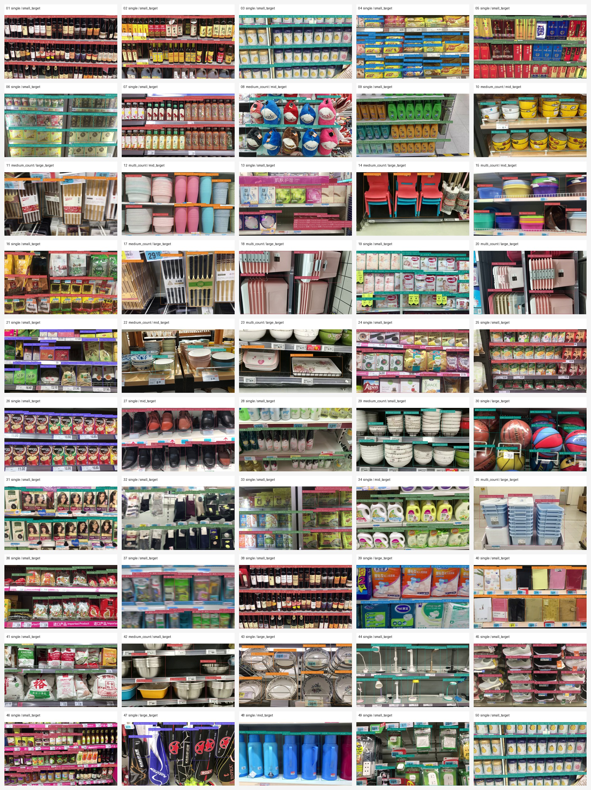
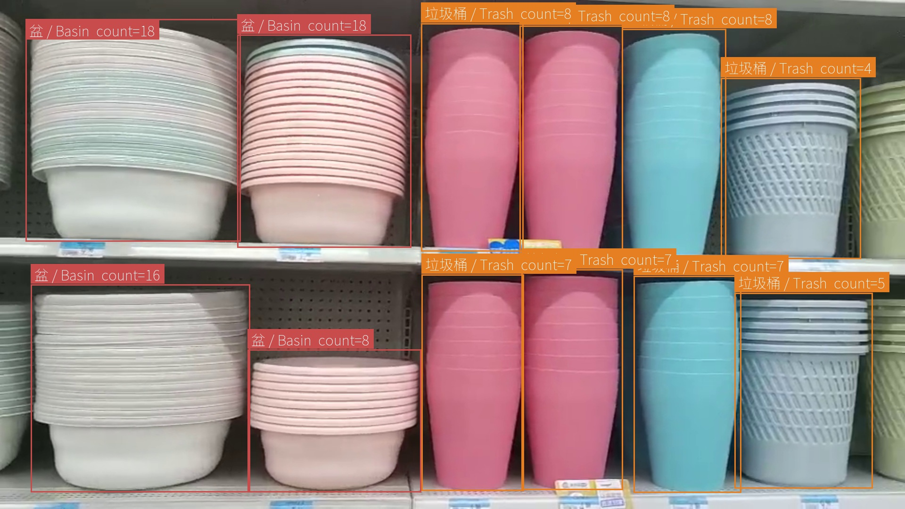
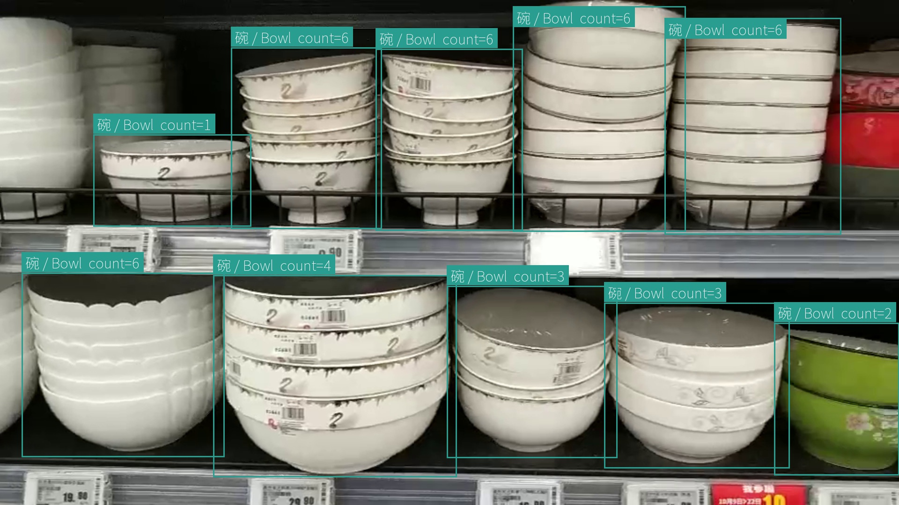
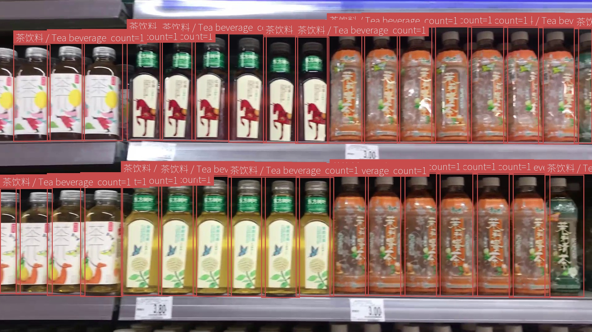

# YOLOv8 超市商品缺货智能监测系统

一个基于 YOLOv8 和 MobileNetV3 Count 的本地超市货架监测应用。系统通过浏览器摄像头或本地视频获取画面，完成商品检测、数量估计、库存状态同步、缺货告警和统计报表展示。

## 主要功能

- 用户注册、登录、JWT 鉴权和密码修改。
- 浏览器摄像头与本地视频实时检测，并在画面中显示识别结果。
- 对每个 YOLO 检测框估算商品数量。
- 商品库存的新增、编辑、删除、筛选和分页管理。
- 检测标签与库存商品的映射维护。
- 根据库存阈值和连续帧确认结果同步正常、低库存及缺货状态。
- 缺货告警查询、处理和 WebSocket 实时推送。
- 库存看板、历史趋势、分类统计和报表导出。
- 库存确认帧数和摄像头展示信息的持久化设置。

## 技术栈

| 模块 | 技术 |
| --- | --- |
| 后端 | Python、FastAPI、SQLAlchemy、SQLite、JWT |
| 前端 | React 19、TypeScript、Vite 6、Tailwind CSS、Recharts |
| 目标检测 | Ultralytics YOLOv8、PyTorch、OpenCV |
| 数量估计 | PyTorch、torchvision、MobileNetV3-Large |
| 通信 | REST API、WebSocket |

## 运行流程

```text
浏览器摄像头 / 本地视频
        |
        v
React 前端采集画面帧
        |
        v
WebSocket 发送至 FastAPI 后端
        |
        v
YOLOv8 完成商品检测
        |
        v
MobileNetV3 估算检测框内商品数量
        |
        +----> 检测结果返回前端展示
        |
        v
标签映射与库存状态同步
        |
        v
库存历史、缺货告警、看板与报表
```

实时检测使用 `/api/v1/camera/stream`；认证、库存、标签映射、告警、报表和系统设置通过 `/api/v1` 下的 REST API 提供。

## 识别效果

以下为测试集中的部分商品检测与数量估计结果。检测框标签同时显示商品的中英文类别名称和 Count 模型给出的框内商品数量。

**50 组测试样例总览**



**典型检测结果**

<p align="center">
  
  
</p>

<p align="center">
  
</p>

## 项目结构

以下为仓库中与应用运行直接相关的核心文件和目录：

```text
YOLOv8_Project/
├─ backend/                 FastAPI 应用、数据模型、业务服务和后端测试
├─ frontend/                React/Vite 前端应用
├─ count_module/            商品数量估计模型与推理接口
├─ config/                  训练和推理使用的轻量配置
├─ examples/                YOLO 与 Count 集成示例
├─ scripts/                 启停、初始化、数据准备、训练和评估脚本
├─ .env.example             环境变量示例
├─ requirements.txt         Python 依赖
├─ package.json             全栈开发启停命令
├─ LICENSE                  MIT 许可证
└─ README.md                项目使用说明
```

## 数据集

本人使用 [LoCount 数据集](https://isrc.iscas.ac.cn/gitlab/research/locount-dataset) 完成本项目的 YOLOv8 商品检测模型与 Count 数量估计模型训练和验证。LoCount 来源于 AAAI 2021 论文 [《Rethinking Object Detection in Retail Stores》](https://ojs.aaai.org/index.php/AAAI/article/view/16178)，面向零售货架场景，将同类商品组作为检测目标，并在标注中同时记录目标框、商品类别和框内实例数量。

- 官方项目页：[AAAI2021 LoCount Dataset](https://isrc.iscas.ac.cn/gitlab/research/locount-dataset)（当前可能要求登录）。
- 数据集下载：[百度网盘](https://pan.baidu.com/s/1WTzOr3metW-BTBFdslgFUg?pwd=e24y)，提取码 `e24y`。
- 标注核心字段：`x1,y1,x2,y2,cls,cnt`，分别表示目标框坐标、类别和框内数量。

仓库不包含 LoCount 数据文件。本项目的训练和推理流程不限定使用 LoCount；其他数据集在划分训练、验证和测试集，并转换为 YOLO 检测标注及 `counts.csv` 计数标注后，也可以用于训练。相关数据准备入口见 `scripts/prepare_locount_tvt_dataset.py`，计数标注格式见 `count_module/COUNT_MODULE.md`。

LoCount 数据集的使用与再分发遵循其来源页面和作者给出的条款，不属于本仓库 MIT 许可证的授权范围。

## 环境与依赖

- Windows 10/11。根目录的一键启停脚本按 Windows 环境设计。
- Conda，以及名为 `env1` 的 Python 3.10 环境。
- Node.js 18 或更高版本及 npm。
- Python 依赖以 `requirements.txt` 为准，前端依赖以 `frontend/package-lock.json` 为准。
- NVIDIA GPU 和匹配的 CUDA 环境不是启动必需项，仅用于加速推理或训练。

仓库不包含数据集、数据库、运行日志和模型权重。自定义检测模型默认放在 `models/best.pt`；未提供时会回退到 `yolov8n.pt`，首次加载可能由 Ultralytics 下载。Count 模型默认放在 `weights/count_best.pt`；未提供时每个检测框按数量 1 回退。离线运行时请提前准备所需模型文件。

## 快速开始

在项目根目录使用 PowerShell 执行：

```powershell
conda create -n env1 python=3.10 -y
conda run -n env1 python -m pip install -r requirements.txt
npm --prefix frontend ci
Copy-Item .env.example .env
```

打开 `.env`，将 `AUTH_SECRET_KEY` 修改为随机长密钥，然后启动项目：

```powershell
npm run dev
```

首次启动会自动创建本地数据库和演示管理员。

| 服务 | 地址 |
| --- | --- |
| 前端 | <http://127.0.0.1:3000> |
| 后端 | <http://127.0.0.1:8000> |
| API 文档 | <http://127.0.0.1:8000/docs> |

默认管理员账号为 `admin`，密码为 `88888888`。首次登录后请修改密码。

停止项目：

```powershell
npm run stop
```

## 许可证

本项目代码基于 [MIT License](LICENSE) 发布。LoCount 数据集、模型权重及其他第三方资源保留各自的许可和使用条款。
